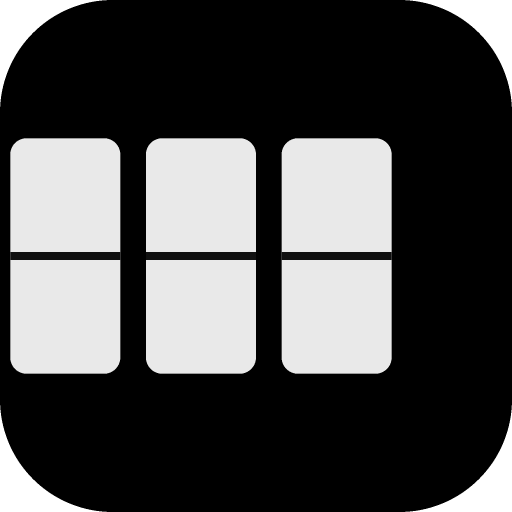
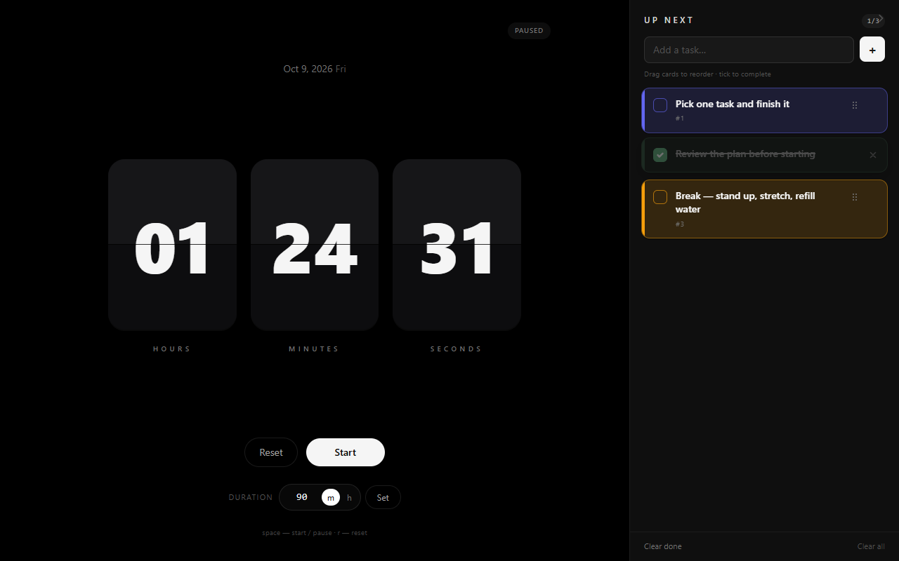

<div align="center">
  
  <h1>Timer</h1>
  <p>A split-flap countdown timer with a draggable task list. Installable, works offline.</p>
</div>

---



A 70/30 split: a black split-flap clock on the left, your task list on the right.
No accounts, no server, no tracking — everything lives in `localStorage`.

## Features

**Clock**
- Split-flap panels showing **hours, minutes and seconds**, with a real folding leaf on every change
- Any duration you like: type `8h`, `90m`, `1h30m`, `2 hours`, `0.5h` or just `45`
- Drifts by nothing — the countdown is derived from a wall-clock deadline, not a tick count
- Rings three tones and stops at `00:00`; press **Run again** to repeat the same duration
- Changing the duration resets the countdown; nothing advances on its own

**Tasks**
- Every new card is given a **random colour**, and never the same one twice in a row
- **Drag to reorder** (the handle appears on hover)
- Tick a card to finish it — it fades out and strikes through
- Delete per card, plus *Clear done* and *Clear all*
- Collapses to a 56 px rail so the clock can have the room

**Everywhere else**
- **PWA** — installable to the home screen, works fully offline via a service worker
- **Phone landscape** gets the same side-by-side layout, with a compacted vertical rhythm
- Works in portrait too — it stacks
- `space` and `r` shortcuts, and the dark scheme is fixed rather than following the OS

## Getting started

```bash
npm install
npm run dev          # http://localhost:5173
```

| Script | What it does |
| --- | --- |
| `npm run dev` | Dev server with hot reload |
| `npm run build` | Type-check, then build to `dist/` |
| `npm run preview` | Serve the production build (needed to test the service worker) |
| `npm run lint` | Lint with oxlint |
| `npm run icons` | Regenerate the PWA icons into `public/` |

> **The service worker is off in dev on purpose** — a caching worker fights with hot reload.
> Run `npm run build && npm run preview` to test install and offline behaviour.

### Keyboard

| Key | Action |
| --- | --- |
| `space` | Start / pause |
| `r` | Reset to the full duration |
| `Enter` | Apply the duration you typed |

## Tech

React 18 · Vite 8 · TypeScript · Tailwind CSS v3 · [`cite-ui`](https://www.npmjs.com/package/cite-ui) · `vite-plugin-pwa`

`cite-ui` provides the toast notifications and the `localStorage` hook. Everything else —
the flip animation, drag-and-drop, duration parsing — is hand-rolled and dependency-free.

### Layout

```
src/
  App.tsx                    70/30 grid, persistence, collapse state
  components/
    Clock.tsx                the countdown, controls, duration field
    FlipPanel.tsx            one split-flap panel (static halves + folding leaf)
    DurationInput.tsx        duration parsing + the m/h toggle
    TaskList.tsx             add, reorder, clear
    TaskCard.tsx             one draggable card
    CollapseRail.tsx         the narrow rail when the panel is collapsed
  lib/
    duration.ts              parse "8h" / "90m" / "1h30m" → minutes
    tasks.ts                 task type, colour palette, helpers
  hooks/
    useLocalStorage.ts       typed wrapper around cite-ui's hook
scripts/
  gen-icons.mjs              PNG encoder + the icon artwork
```

## Icons

`npm run icons` writes `icon-192.png`, `icon-512.png`, a maskable variant and the Apple touch
icon. The script encodes the PNGs itself using Node's built-in `zlib`, so regenerating the
artwork needs no image tooling.

## Deploying

The build output is a static site — host `dist/` anywhere. A PWA needs **HTTPS** to be
installable (localhost excepted). Nothing is server-side.